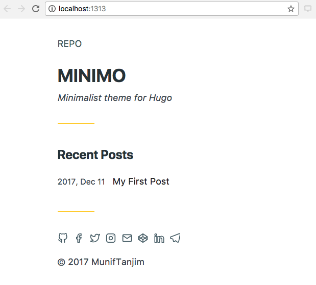
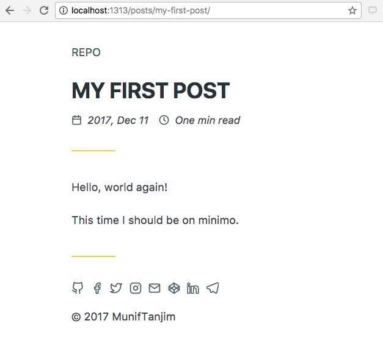

<!-- toc -->

- [Build in Hugo](#build-in-hugo)
  * [1. Setup](#1-setup)
  * [2. Create site](#2--create-site)
  * [3. Configure site](#3-configure-site)
  * [4. Add content](#4-add-content)
  * [5. Preview site](#5-preview-site)
  * [6. Learn more!](#6-learn-more)
  * [7. Host the site](#7-host-the-site)

<!-- tocstop -->

# Build in Hugo

## 1. Setup

- [x] Install Homebrew https://brew.sh/

*A package manager. It runs through PATH and reassigns admin and user controls.*
```
/usr/bin/ruby -e "$(curl -fsSL https://raw.githubusercontent.com/Homebrew/install/master/install)"
```


- [x] Install hugo

```
brew install hugo
```
(and check with ```hugo version```)

## 2.  Create site

In home directory, call folder 'Exocytosis_blogsite'

```
hugo new site Exocytosis_blogsite
```

returns
```
Congratulations! Your new Hugo site is created in /Users/naomipenfold/Exocytosis_blogsite.

Just a few more steps and you're ready to go:

1. Download a theme into the same-named folder.
   Choose a theme from https://themes.gohugo.io/, or
   create your own with the "hugo new theme <THEMENAME>" command.
2. Perhaps you want to add some content. You can add single files
   with "hugo new <SECTIONNAME>/<FILENAME>.<FORMAT>".
3. Start the built-in live server via "hugo server".

Visit https://gohugo.io/ for quickstart guide and full documentation.
```

- [x] Add theme: minimo

Instructions: https://minimo.netlify.com/docs/installation/

Can install by cloning whole minimo repository or by adding as a submodule. What's a submodule? [Git docs](https://git-scm.com/book/en/v2/Git-Tools-Submodules) - it's like adding a link into your project, rather than copy-pasting code in. This makes it easier to manage as a dependency. This seems to make sense, so I'll add as a submodule instead of cloning.

```
git submodule add https://github.com/MunifTanjim/minimo themes/minimo
git submodule init
git submodule update
```

:exclamation: This is an error. The GitHub url should end in .git!
i.e. ```git submodule add https://github.com/MunifTanjim/minimo.git themes/minimo```

## 3. Configure site

As per instructions: "For getting started with Minimo, copy the config.toml file from the exampleSite directory inside Minimo’s repository to your site repository"

```
cp themes/minimo/exampleSite/config.toml ~//Exocytosis_blogsite
```

The base config.toml contains:

```
baseURL = "http://example.org/"
languageCode = "en-us"
title = "My New Hugo Site"
```

A full config.toml is visible at https://minimo.netlify.com/docs/example-config-toml/

Amend the basic details, e.g. site title. Leave the baseURL blank whilst testing locally.

And add ```theme = "minimo"``` to the config.toml

What do I want to include on my page?

* Social media links: GitHub and Twitter.
* Copyright: decide on copyright for the site and its content.
* TBC: Say it's made using Hugo (link) with theme Minimo (link) and deployed using Netlify (link) and hosted p2p via Beaker Browser and via HTTP using hashbase.io.

## 4. Add content
<!--
```
hugo new posts/hello-world.md
```

This doesn't work because it can't find my Minimo theme. I added minimo direct to the parent blog folder, not within /themes.
So I moved 'archetypes', 'data', 'layouts', 'static' and 'config.toml' all to /themes (using ```mv [CURRENT FILEPATH] [DESTINATION FOLDER]``` in terminal), leaving 'content' and 'themes' in the parent directory.
I guessed which folders to move based on the GitHub repo for Minimo (there was no content folder, but the rest were there).

:exclamation: :exclamation: Nope! I needed to put all these things in themes/minimo !

```
cd themes && mkdir minimo
mv [all relevant folders] ~/themes/minimo
```

Ok now creating a new post works. Actually, fiddling around a little tells me I only need /archetypes under /themes/minimo/. The rest should be all under the parent directory. -->

Create my-first-post with ```hugo new posts/my-first-post.md``` and open in atom ```atom my-first-post.md``` to add some text.

## 5. Preview site

Start Hugo server with drafts enabled

```
hugo server -D
```

I can now view this in my local browser at http://localhost:1313

<!-- Nope. It loads nothing. Not even an error.

Looking back at Hugo instructions, downloading a theme was different. Followed this instead:

```
mkdir quickstart;git init;git submodule add https://github.com/MunifTanjim/minimo themes/minimo
```
and removed the previous folders and files (except content and the config.toml)
Do need config.toml in the parent directory. Simplified it to just be title, etc (minimum needed).

:exclamation: ERRORS
ERROR 2017/12/11 14:02:49 No 'baseURL' set in configuration or as a flag. Features like page menus will not work without one.
Started building sites ...
ERROR 2017/12/11 14:02:49 Error while rendering "home": template: theme/index.html:12:9: executing "theme/index.html" at <partial "home/recent...>: error calling partial: template: theme/partials/home/recent_posts.html:10:15: executing "theme/partials/home/recent_posts.html" at <first .Site.Params.s...>: error calling first: both limit and seq must be provided

Error 1 is ok, I've not added a base URL yet.
Error 2 - I don't understand, nor from Googling it.

---

restart

Trying Hugo again but following their quickstart tutorial including the theme they specify (maybe it's the theme I picked).

It worked.

Let's try again and just sub out the github repo for the theme.
Aha! For ananke, there was .git at the end of the repo name. In the minimo instructions, the .git is missing. Let's try with it (since that's the URL for git checkout). -->


Right let's try spinning up the local server again.
:exclamation: Make sure I'm in the site parent directory when running ``` hugo server -D``` otherwise it doesn't work!

<!-- Nope. Still an empty window. No error codes, just not displaying. Maybe minimo is not a good theme to start with!

So the installation guide for minimo says to copy the config.toml from the examplesite folder into the site folder and go from there. Did that and -->
Voila, we have a basic site!



And my first post...



## 6. Learn more!

The Hugo directory structure is explained at https://gohugo.io/getting-started/directory-structure/

e.g.
* Archetypes - you can specify types of post and use these as templates when creating a new post
* You can add different sections to your content folder, e.g. to separate blogposts and tutorials. you can also specify ```type = "x"``` in the front matter of a post, if you've defined a layout for that type.
* Data is used to store config files, and you can add dynamic data templates. E.g. you can add a list of your starred github repos! https://cyrillschumacher.com/github-starred/
* layouts --> template .html files to specify how your content will be rendered into a static website.
* static --> stores all static content e.g. images, CSS, JavaScript.

It's a good idea to have a site/public and site/dev structure, so that any draft posts are tested in dev first, before being ported over to public (and therefore published).

## 7. Host the site

Ok so now I have a basic site build.

I need to host it somewhere. This is what Netlify can help with. It takes static site files and deploys them.

Sign up for a free personal account.
I've copied the working minimo initial site over into a new directory called 'exocytosis' to form the basis of my blogsite. I drag that directory into the drag-and-drop space on netlify, and it begins to deploy.
I change the site name: exocytosis.netlify.com

I can set it up to continuously deploy form GitHub (or other): https://app.netlify.com/sites/exocytosis/settings/deploys

I can add a custom domain: https://app.netlify.com/sites/exocytosis/settings/domain

But the Netlify site isn't up. Not sure why not.

Pushed the Hugo directory to GitHub [repo](https://github.com/npscience/Hugo-blogsite-Exocytosis) and connected that to Netlify. Used ```hugo``` as build command. Still not working. TBC...

So that's traditional websites. I need the framework for the site and content (Hugo) and then to deploy it to the web (Netlify).
To map onto a domain I own, I need to use SSH [not done].
