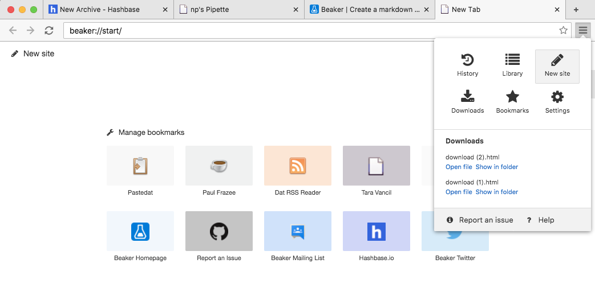
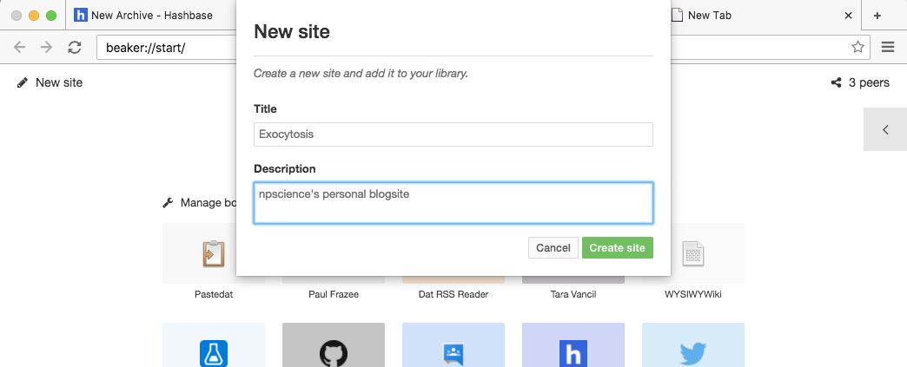
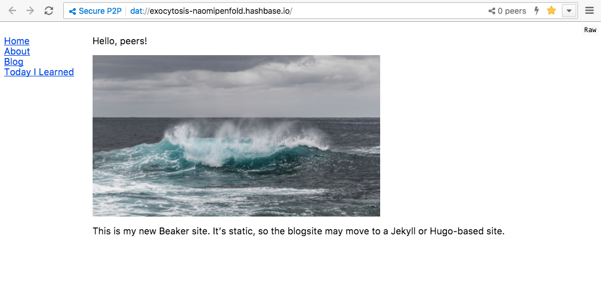
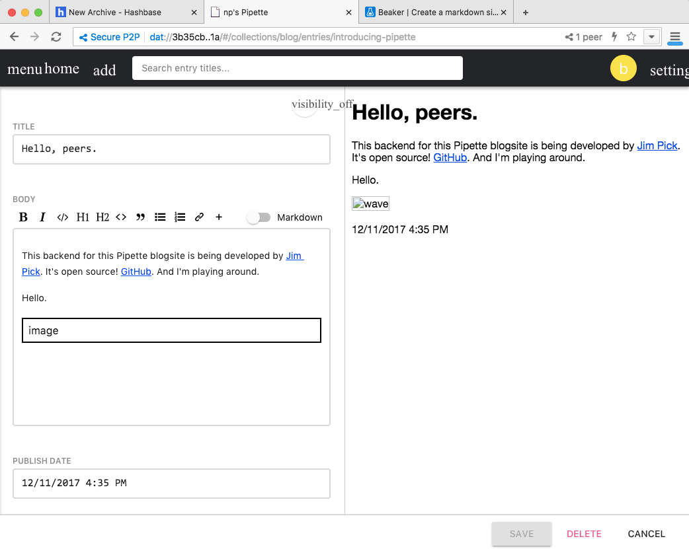
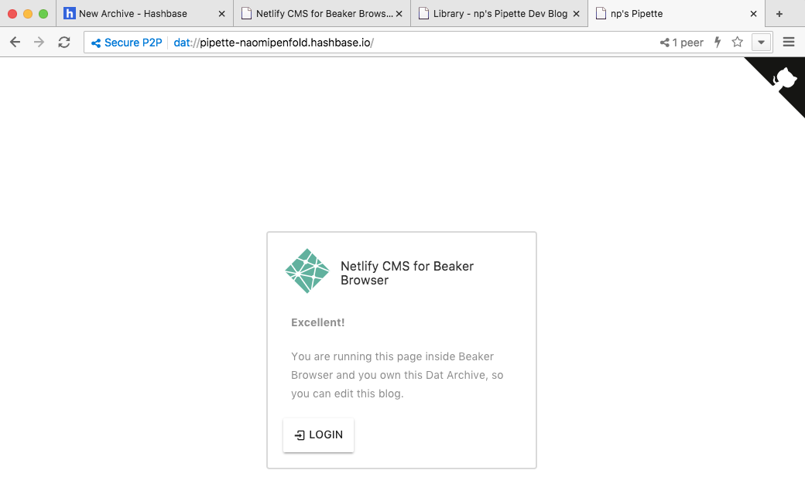
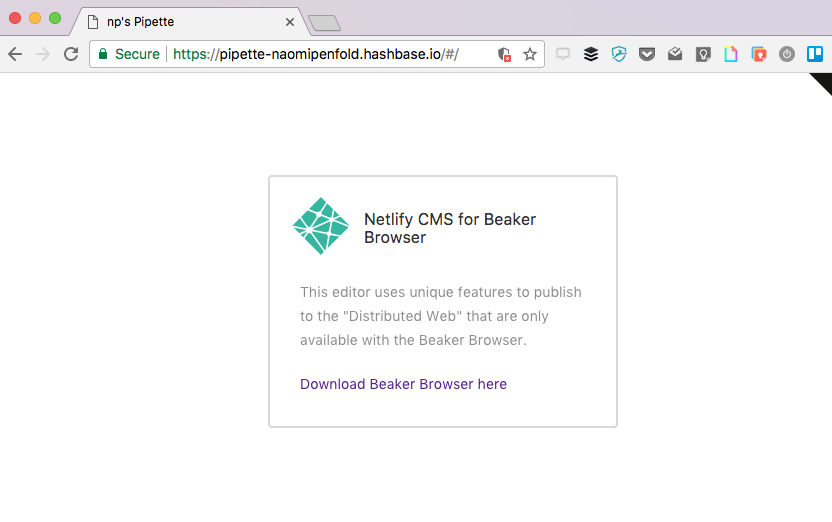

<!-- toc -->

- [What about making a simple site on Beaker?](#what-about-making-a-simple-site-on-beaker)
- [What about making one using Pipette?](#what-about-making-one-using-pipette)

<!-- tocstop -->

Qs I have re Beaker from Dat tutorial:
Q1. Where should I store my files locally for Beaker to read them?
A1. Beaker creates directory automatically for you in your user directory /Sites.

Q2. How do I get started as a peer on Beaker?
A2. This also happens automatically.

# What about making a simple site on Beaker?

The joy of Beaker is its simplicity:
* Write in markdown
* Fork (copy) someone else's site and customise for yourself
* Live updating on Beaker as you edit your files
* Use hashbase as a superpeer to keep your content live (by archiving your dat) and to provide access via HTTPS (to engage the masses)

So let's give this a go then!

Tutorial: https://beakerbrowser.com/docs/tutorials/create-a-markdown-site.html

- [x] Install Beaker Browser
- [x] Get an account on hashbase.io - can act as a super-peer to host my content while I'm offline.

From Beaker Browser, I add a new site.



And add some basic details:



This creates a folder 'exocytosis' under my local 'Sites' directory with a dat.json inside only.

I add 'index.md' and 'nav.md' (using ```touch``` in the command line).

* Index.md will be my homepage
* Nav.md will give me a navigation pane

I created some .md pages and a navigation list.
I archived my site on hashbase.
It's viewable on Beaker Browser at dat://exocytosis-naomipenfold.hashbase.io/



^^ This was pretty easy.

Drawback: it's a static site only. I need to learn how to structure it to have multiple 'listings' pages for the different blog sections.
Markdown is super simple, but sometimes too simple. I had to insert some HTML to deal with an oversized image!

# What about making one using Pipette?

Pipette https://pipette-dev-blog-jimpick.hashbase.io/post/introducing-pipette/

Fork the CMS, e.g. Netlify CMS https://www.netlifycms.org/. Use Beaker for this (dat://d6185c1680001cd2260a0f31bfb209edbf97551774dc6175c110019d9020199d/). Delete the content and change the blog title.

Cut all the blogs and added a first entry: Hello, peers.
My pipette microblogsite is at:
dat://3b35cb9dc42908bd3f23f9a02e43f6bc743fda05e1c54d9dee303ffd4299ec1a



Navigate in my directory. My pipette site is at ~/Sites/nps-pipette-dev-blog.
I can clear the image and blog content, change some of the files, clear out some of the other files I don't know about. slim it down.

On Beaker, I can open up the directory via my library, and see changes. Can commit them.
Click share and get Dat URL. Enter this to archive it on hashbase.io (under my account.)
It comes up untitled and without a description --> need to add one in dat.json metadata file? No, they're there. Not sure why not pulled in here.

I can access this via dat link on Beaker:


And hashbase alo provides a https link BUT the Pipette blogsite is not supported via web, only via Beaker.



Because Pipette is not supported for HTTPS it isn't particularly useful for me at this stage.
