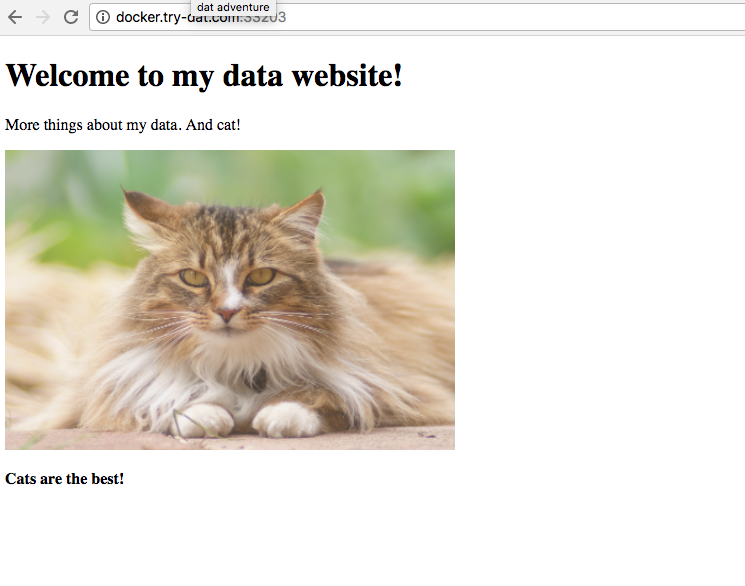
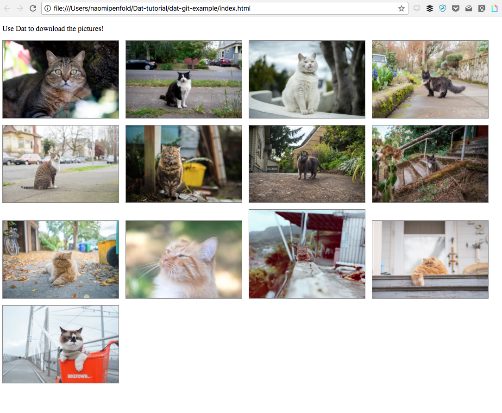
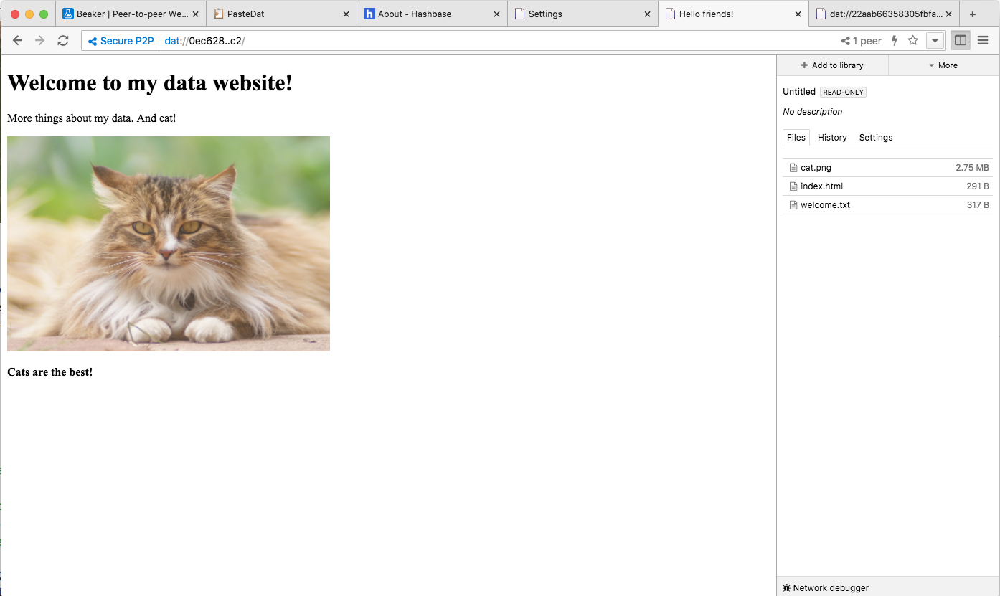
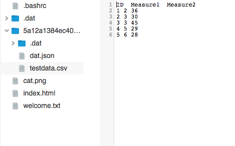

# Dat tutorial

Try this yourself at https://try-dat.com

Time taken, including documentation and also doing some research on file transfer protocols, ~5 hours. the tutorial itself, probably ~3 hours.

> FAO Danielle: I've added :exclamation:**User note** throughout so you can see the bits I stumbled on, and why. I hope this helps :grey_question:

**Contents**
<!-- toc -->

- [Setup](#setup)
- [Dat tutorial](#dat-tutorial)
  * [1. Share files using Dat](#1-share-files-using-dat)
  * [2. Clone a dat directory](#2-clone-a-dat-directory)
  * [3. Sync a directory](#3-sync-a-directory)
  * [4. Host a website](#4-host-a-website)
  * [5. Downloading a partial dataset from Git](#5-downloading-a-partial-dataset-from-git)
  * [6. Host your site in Beaker](#6-host-your-site-in-beaker)
  * [7. Distribute scientific data using Dat](#7-distribute-scientific-data-using-dat)
  * [8. Desktop application](#8-desktop-application)
  * [9. Import genomic data into Dat with the JavaScript API](#9-import-genomic-data-into-dat-with-the-javascript-api)
- [Summary of what I've learned](#summary-of-what-ive-learned)

<!-- tocstop -->

*Table of contents generated using [markdown-toc](https://github.com/jonschlinkert/markdown-toc)*

## Setup

1. Install Node.js (which includes npm) from https://nodejs.org/en/
*I installed 8.9.2 LTS*

Node and npm were installed to the path /usr/local/bin
In order to be able to call these packages from the terminal, I needed to check /usr/local/bin was in my computer's PATH:

Open Terminal in Mac. Type
`echo $PATH`
returns
`/Users/.../...:/usr/local/bin:/usr/bin:/bin:/usr/sbin:/sbin:...`
*(Some paths obscured)*

As you can see, there is a list of paths each separated by : and /usr/local/bin is there. So we're all good. I can call node and npm from the terminal.

Instructions [here](https://coolestguidesontheplanet.com/add-shell-path-osx/) for checking the PATH and adding a new path to it.

Check that node and npm are installed:
`node -v` and `npm -v` returns the version number of the package installed. Hey presto!
*I have Node v8.9.2 and npm v5.5.1*

2. Use npm to install dat

```
npm install -g dat
> Error: EACCES: permission denied, access '/usr/local/lib/node_modules'
```

Oops! I don't have write access. Instead, I need to run the command as a superuser with admin privileges, which requires using `sudo`

*For more about ```sudo```, type ```man sudo``` into the terminal.  (Note: to exit the manual, type ```q```!)*

```
sudo npm install -g dat
```
asks me for my admin password, and then BAM, we are go! For the nerds who care, the 347 packages within Dat took 19.487secs to install on my machine. #stats

Checking...

```
dat -v
> 13.9.2
```

*[Note: v stands for version. Checking for the version number of a package gives you the answer you need for whether you have that package installed or not.]*

Ok, so now I have Dat installed. Here's what I can do with it (source: the Dat tutorial):

```
$ dat

Usage: dat <cmd> [<dir>] [options]

Sharing Files:
   dat share                   create dat, import files, share to network
   dat create                  create empty dat and dat.json
   dat sync                    import files to existing dat & sync with network

Downloading Files:
   dat clone <link> [<dir>]    download a dat via link to <dir>
   dat pull                    update dat & exit
   dat sync                    live sync files with the network

Info:
   dat log                     log history for a dat
   dat status                  get key & info about a local dat

Dat public registries:
   dat <cmd> [<registry>]      All commands take <registry> option
   dat register                register new account
   dat login                   login to your account
   dat publish                 publish a dat
   dat whoami                  print active login information
   dat logout                  logout from active login

Stateless/Shortcut Commands:
   dat <link> [<dir>]          clone or sync link to <dir>
   dat <dir>                   create and sync dat in directory

Troubleshooting & Help:
   dat doctor                  run the dat network doctor
   dat help                    print this usage guide
   dat <command> --help, -h    print help for a specific command
   dat --version, -v           print the dat version


Have fun using Dat! Learn more at docs.datproject.org
```

## Dat tutorial
https://try-dat.com/
opens a virtual server in a window.

Let's get started :hatching_chick:

### 1. Share files using Dat

In the machine with the files you have to share, enter the terminal and type
```
dat share
```
This will return a message like:
```
dat

v13.9.0                                                                                                                  
Created new dat in /[PATH]/.dat                                                                                                
dat://[...shhh I'm secret...]                                                       
Sharing dat: [X] files ([X] MB)
...
```

The dat://.... address is now your link to share with anyone you want to provide access to your files. It's unique, secret and secure. So you can share with only the people you want to.

>:exclamation:**User note**
> *In the tutorial, running this command in the virtual terminal (top-right) is supposed to create a .dat folder in the virtual directory (bottom-right hand side), but it doesn't show immediately. Refreshing the page takes me back to the start but now the .dat directory is there.*

Create a new directory in the machine I want to share the files too (for the tutorial, that's my local machine).

```
mkdir Dat-tutorial
```
creates /Dat-tutorial (check it's there using `ls`)
*Note to anyone new to the command line: in terminal, ```mkdir``` creates a new folder and ```ls``` lists all the directories in my current location*

Jump into //Dat-tutorial using `cd ~/Dat-tutorial`
*And ```cd``` is the command for navigating through your folder system: cd .. takes you up one, cd foldername takes you to that folder if you're in the parent to it.*

Now I'm working inside my new Dat-tutorial directory.

### 2. Clone a dat directory

In my local machine's terminal `dat clone dat://....` using that long and complicated dat link from the machine with the files I want access to.

Dat opens a connection, and downloads the directory (with enclosed files) to my machine in the folder I specified (/Dat-tutorial).
It even states `Cloning X files (X MB)` so I can check it's the same as I expect.

Note: if you are not in the directory you want to add the files to already, you can specify this location at the end of the clone command, e.g. `dat clone dat://.... Dat-tutorial`

Check that the files are there (`ls`): in /Dat-tutorial I now have a new directory with the name matching the dat hash, and inside that are the two files I was expecting (welcome.txt and cat.png).

To close the dat connection from the original machine (the virtual one in the tutorial window), ctrl+c in that terminal.

### 3. Sync a directory

If a file changes in the original location, you will need to update the file in the location you shared to using sync.

In the original location, run `dat share` to update the hash

In the location shared to, navigate to the directory containing the dat directory (/Dat-tutorial) and run `dat sync`

> :exclamation:**User note**
> *Problem! I get an error: No existing archive in this directory.
I am in /Dat-tutorial and I can see a directory with the dat hash in it.*
> `Dat doctor` *doesn't shed any light. Note: to stop this command on Mac, use ctrl+c. I need outside help, can't work this out...
> OH! I worked it out. I need to be in the dat directory inside my directory location, i.e. `cd ~/Dat-tutorial/[long hash] && dat sync`...that works.*

Check the file change I made in the original machine is replicated across:

```
open welcome.txt
```

Opens the .txt file I changed. And I can see my change! :tropical_fish: *[It's important to feed the kitty.]*


### 4. Host a website

Create a homepage
*[Command line tip: ```touch``` creates a file]*

```
touch index.html
```

Edit index.html to add basic info (in HTML).
See what it looks like:
```
open index.html
```
will display the file in your browser (HTML autorenders).

To share this file via the web, you need to serve it via http:
```
dat share --http=$PORT_80
```

This will return a http://localhost:XXXXX address indicating we are hosting the file locally. But the tutorial is running in Docker, so actually we need to point people to the docker container, and that address is in welcome.txt. Typing that address into your browser, you should see your basic index page, rendered from HTML.



> :exclamation:**User note**
> *I tried to use the localhost:... address given in the response to the http serving call; error: the localhost is refusing to connect.
> OH! The address I'm serving to is actually listed in the welcome.txt file — it's the http://docker.try-dat.com:XXXXX link.
> BONUS: And I can edit index.html on the fly, in the terminal I can see the log of changes (Dat is watching) and if I refresh the page in the browser, I can see the edited page!
> Note I also tried this via local machine but got this error:*
> `Archive not writable, cannot use share. Please use sync to resume download.``
> *Probably because on my work laptop, my user account does nt have admin privileges.*


### 5. Downloading a partial dataset from Git

The GitHub repo should contain a dat.json file that specifies the dat://... link plus other metadata about the data.

A .datdownload file specifies the files to download by default when someone clones using the dat link. Otherwise, they risk downloading the entire folder.

*I wonder if it's a good idea to include the size of the whole directory in the dat.json, so the user can look this up before deciding whether to do a partial or full download.*

To download the dat using Git, first I need to [install Git](https://git-scm.com/book/en/v2/Getting-Started-Installing-Git)
and add the path it's in to my PATH.
*Ssee link earlier about this! Use ```PATH=[paste in your current PATH details from the echo return]:[add new path here]``` (note the order matters, the first path listed takes priority, but that doesn't matter to me right now.*

```
git --version
```
returns `git version 2.15.0` and tells me git is now successfully installed.
*Note the syntax for checking the version number is different (--version instead of -v), that's because all of these things are built and written by humans...*

Ok, so now I have Git. Navigate back into /Dat-tutorial and git clone the tutorial repo:

```
git clone https://github.com/joehand/dat-git-example.git
```

37 objects were unpacked.
Is it there? `ls` lists dat-git-example in the current directory
Navigate in `cd dat-git-example` and `ls` to see what's there.

```
dat.json    index.html    readme.md
````

So we have the basic files in the git repo (check online at https://github.com/joehand/dat-git-example.git) but not any of the data specified in Joe's .datdownload file in that repo.

```
open index.html
```
And in the new browser window, we can see that Joe has set us a task. There's text and empty picture boxes — we need to use Dat to download the image files to go in these boxes. Cheeky! :cat:

> :exclamation:**User note**
*I accidentally downloaded all files not partial files....
Back in the parent directory (/Dat-tutorial), we can connect to Joe's data files in the git repo using dat: `dat clone ./dat-git-example` downloads 14 files (40MB).
> I was meant to just retrieve the metadata using `dat clone ./dat-git-example --empty` but now I can't get this to work. ERROR: TypeError: Cannot read property 'length' of undefined
> To try again with --empty and get just the dat metadata, I deleted the 14 files from the directory. But now, the dat log thinks I'm synced, even though I no longer have the 14 files in the directory. I WANT MY CAT PICTURES.
> Options: retrieve the trashed files and manually move them back in? Not sure I can do much else and I wanna see those pussycats. No, wait. Delete the whole dat-git-example directory and restart...
> in /Dat-tutorial `git clone https://github.com/joehand/dat-git-example.git` then `cd dat-git-example` and `open index.html` to display the page with missing cat pics in my browser. Yup, they're still missing.
> Go back up one to parent directory (`cd ..`) and `dat clone ./dat-git-example --empty` ...
> IT WORKED THIS TIME! (Why didn't it last time? Curious...)*

It returns:
```
Dat successfully created in empty mode. Download files using pull or sync.
```

Retrieve the base files specified in Joe's .datdownload:
```
dat sync ./dat-git-example
```

3 files (7.6MB) downloaded

Check they're there: `cd dat-git-example && ls`
*(Command line note: && combines commands so you can do this all in one line)*

We have
```
cat-1.jpg	cat-2.jpg	dat.json	index.html	readme.md
```

And Joe's  .datdownload specified:
cat-1.jpg
cat-2.jpg
dat.json

SO THIS IS TRUE. Woohoo. Don'tcha love it when a plan comes together.

Let's refresh the cat page in my browser. And now we have the first two kitty pics. Mad eyes, that first one... :scream_cat:

**How do I get the rest of the pics?**
This isn't in the tutorial, but worth a play... Aha! Just do
```
dat clone ./dat-git-example
````
without the --empty. That downloads all 14 files.
Refresh the browser window and BINGO. Mischief managed. :dizzy:



*Cat-10 reflects how smug I feel right now.*

### 6. Host your site in Beaker

Remember the basic webpage we created earlier on (points 4 & 5), well we can serve this not only on the Web via HTTP but also amongst peers on Beaker Browser, a decentralised read-write p2p web that runs on dat.

[Install Beaker](https://beakerbrowser.com/docs/install/).

The tutorial says I can simply paste my secret dat:// link into Beaker Browser and it should work.

> :exclamation:**User note** *But it doesn't. Aha, I need to reopen my dat connection!*

So in the virtual machine on the tutorial `dat share` to open the connection and then that dat link opens up my basic webpage (index.html) in Beaker.



And if I open a dat connection using `dat share` from my local terminal, in the directory that now has both the tutorial docs AND Joe's git example, I get a simple webpage with links to both of these directories. Clicking on the directories takes me to the index.html for each (my basic website and Joe's cat pictures).


When I close the dat connections (local and virtual), both dat links persist on Beaker. This is something to watch about p2p — once it's out there, it's out there. Once a peer has the data, you can't wipe it from history.

### 7. Distribute scientific data using Dat

For this, I am creating a fake dataset.

In /Dat-tutorial directory, create a new .csv and open it
```
touch testdata.csv && open testdata.csv
```

* Add columns{ID,Measure1,Measure2}
* Add fake entries
  * ID:{1:5}
  * Measure1:{RANDBETWEEN(0,9.9)}
  * Measure2:{RANDBETWEEN(20,50)}
* Save

Now to turn my current directory into a dat folder:
```
dat create
```
This returns:
```
Welcome to dat program!
You can turn any folder on your computer into a Dat.
A Dat is a folder with some magic.

Your dat is ready!
We will walk you creating a 'dat.json' file.
(You can skip dat.json and get started now.)

Learn more about dat.json: https://github.com/datprotocol/dat.json

Ctrl+C to exit at any time

Title:
```
So I am prompted to add some simple metadata for my testdata.csv...
```
Title: Testdata
Description:  Test data created for the dat tutorial. These are not real data.

Created empty Dat in /Users/naomipenfold/Dat-tutorial/research-data/.dat

Now you can add files and share:
* Run dat share to create metadata and sync.
* Copy the unique dat link and securly share it.

dat://....shhhh-this-is-secret.....
```
*Note to self: PR typo 'securly' to 'securely'!*

Now let's see if I can share this file with someone, e.g. in the virtual machine in the tutorial...

In my local machine (where my testdata file is), I open a dat connection:
```
dat share
```
In the virtual machine (tutorial):
```
dat clone dat://...[my secret link]...
```
> :exclamation:**User note**
> *Hmmm... it can't find any connections for that link. WAIT, it's because I am in the wrong directory — I'm in /Dat-tutorial not /Dat-tutorial/research-data.
> Ok now I navigate to my research-data directory, run `dat share` and then in the virtual machine `dat clone` and bingo.*

```
Cloning: 2 files (248 B)                                                     

2 connections | Download 254 B/s Upload 0 B/s
```

My tutorial directory now has my research-data dat directory, complete with the dat.json and testdata.csv.



Don't forget to close the dat connection from the local terminal now.

### 8. Desktop application

So you prefer not to use the command line. Me too, for now. Well, Dat also has a desktop application that allows you to create and share data files using Dat but through a friendly interface.

You can install it from https://datproject.org/install for Mac or Linux (Windows coming soon). I've already installed it and gave it a go a while ago, so I won't do anything more with it today. Plus, I'm quite enjoying the command line. :thumbsup:

### 9. Import genomic data into Dat with the JavaScript API

Now this sounds TASTY :eyes: Apparently, we are going to download the flu virus genome from [NCBI](https://www.ncbi.nlm.nih.gov/) with [Bionode](https://www.bionode.io/) and import it into Dat!

In /Dat-tutorial, create new folder called 'influenza' and navigate into it `mkdir influenza && cd influenza`
In this folder, install [bionode-ncbi](https://doc.bionode.io/#bionode-ncbi), a package that "takes a database name and a query term. Returns the metadata [from NCBI]".

```
npm install bionode-ncbi
```

A couple of errors (Bruno, see the note at the end), but installed.
```
+ bionode-ncbi@2.0.1
added 244 packages in 14.276s
```

Create a script.js

```
touch script.js && open script.js
```

Script.js:
```
var Dat = require('dat')
var Bionode = require('bionode-ncbi')

Dat('.', function (err, dat) {
  if (err) throw err
  var download = Bionode.download('assembly', 'ViralMultiSegProj15622')
  download.on('data', console.log)
  download.on('end', function() {
    dat.importFiles()
    dat.joinNetwork()
    console.log('My Dat link is: dat://', dat.key.toString('hex'))
  })
})
```

Run this
```
node script.js
```

:exclamation: **Error: Cannot find module 'dat'**
*Dat is installed, checked -v in the influenza folder. Is the Dat module missing from the bionode packages? I can't find anything about this. Bruno added this page to the try-dat tutorial [GitHub](https://github.com/maxogden/get-dat/blob/master/markdown/103-genomic-data.md); I should tell him about this!*

**Not going to do anymore of this for now, moving onto Beaker**

Now, I feel I've earnt my Girl Guide Dat badge :hatched_chick:


*Courtesy of [shields.io](http://shields.io/) and inspired by [MozWOW](https://github.com/RaoOfPhysics/badges-approved/).*

## Summary of what I've learned

* I've started to dig into file transfer protocols and why dat is different to sharing on the Web using HTTP [Notes to follow](~DOCFILE/Learning-about-Dat.md)
* I've done the Dat tutorial and learnt how to create and share files using Dat
* I've installed Beaker browser and begun to learn about this

Next.... learn more about Beaker and start creating my own blogsite. :clipboard:
Now... MUSIC BREAK :dancer: and share this documentation :ledger:


> :exclamation: **User note for Bruno**
> *I got some errors/warnings when installing bionode:*

```
npm WARN saveError ENOENT: no such file or directory, open '/Users/naomipenfold/Dat-tutorial/influenza/package.json'
npm notice created a lockfile as package-lock.json. You should commit this file.
npm WARN enoent ENOENT: no such file or directory, open '/Users/naomipenfold/Dat-tutorial/influenza/package.json'
npm WARN influenza No description
npm WARN influenza No repository field.
npm WARN influenza No README data
npm WARN influenza No license field.
```
> *And then when running the suggested script.js, it couldn't find the dat module. Dat is definitely installed so I was a bit stuck as to what to do next, and I stopped there.*
